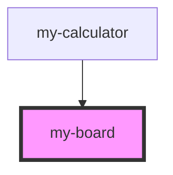

# my-board

<!-- Auto Generated Below -->

## Events

| Event           | Description | Type               |
| --------------- | ----------- | ------------------ |
| `buttonClicked` |             | `CustomEvent<any>` |

## Dependencies

### Used by

 - [my-calculator](../my-calculator)

### Graph

----------------------------------------------

*Built with [StencilJS](https://stenciljs.com/)*
