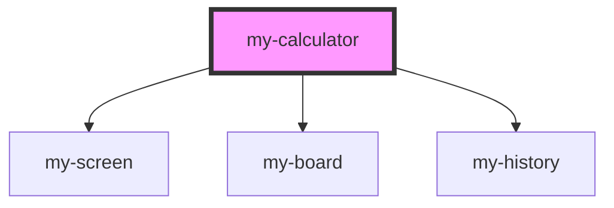

# my-calculator

<!-- Auto Generated Below -->

## Events

| Event             | Description | Type               |
| ----------------- | ----------- | ------------------ |
| `newHistoryEntry` |             | `CustomEvent<any>` |

## Dependencies

### Depends on

- [my-screen](../my-screen)
- [my-board](../my-board)
- [my-history](../my-history)

### Graph

----------------------------------------------

*Built with [StencilJS](https://stenciljs.com/)*
