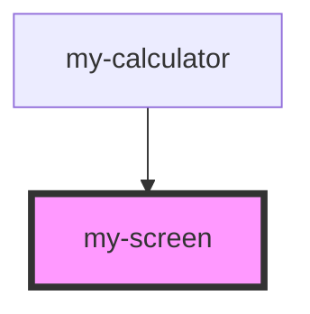

# my-screen

<!-- Auto Generated Below -->

## Properties

| Property  | Attribute | Description | Type     | Default |
| --------- | --------- | ----------- | -------- | ------- |
| `content` | `content` |             | `string` | `'0'`   |

## Dependencies

### Used by

 - [my-calculator](../my-calculator)

### Graph

----------------------------------------------

*Built with [StencilJS](https://stenciljs.com/)*
